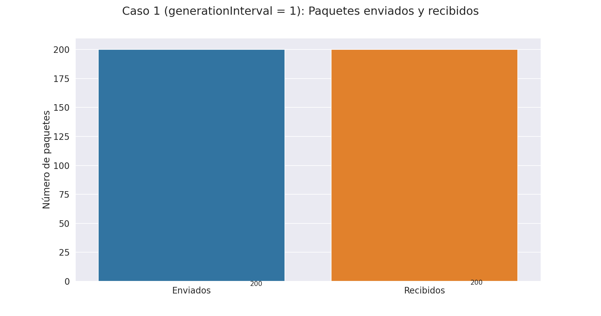

# Laboratorio 3: Capa de Transporte

## Primera parte

El objetivo de esta parte es análizar el tráfico de red de un modelo de colas, que posee bajas tasas de datos y un tamaño acotado en los buffers. El modelo posee tres modulos simples:
Generador: Crea y transmite paquetes con intervalos dados por una distribución exponencial que nosotros podemos configurar.
Queue: Atiende los paquetes, configurada con un valor máximo de 200.
Sink: Se encarga de tomar métricas de la demora de entrega de los paquetes.

El modelo de colas ignora nociones de capacidad relacionadas con la transferencia de datos y memoria para buffers. La primera tarea que se nos presento fue poder extender el *kickstarter* y asi poder agregar estas funcionalidades.

Hicimos modificaciones en `network.ned` este es el archivo que se encargar de establecer todas las conexiones de nuestro modelo. añadimos los modulos NodeTx que esta compuesto por un simple Generador y un simple Queue. y NodeRx con un simple Queue y un simple Sink (Ahora el modelo tiene 3 colas). También fue necesario modificar el modulo gen para que tome como parámetro el tamaño del buffer.

Se realizaron modificaciones en los modulos implementados en `C++`, para que el modelo pueda guardar el tamaño del paquete en bytes, medir el tiempo de servicio en la queue en base a la duración de transmisión del paquete una vez que se haya encolado y que Queue pueda controlar que el tamaño del buffer no sobrepase el límite configurado. 

Por otra parte, se implementaron nuevas métricas (modulo Sink) para el añalisis de Queue, para poder medir la cantidad de paquetes del buffer y la otra que mida la cantidad de paquetes descartados por buffer saturado.

Los supuestos más importantes de las simulaciones son que los paquetes siempre serán de 12500 B de tamaño, los bufferes son fijos (NodeRx = 200 B, NodeTx = 2000000 B y Queue = 200 B). Nosotros analizaremos los siguiente escenarios variando el intervalo de generación de paquetes (generationInterval) entre 0.1 y 1.

- Caso 1:
    - NodeTx a Queue: datarate = 1 Mbps y delay = 100 us
    - Queue a NodeRx: datarate = 1 Mbps y delay = 100 us
    - Queue a Sink: datarate = 0.5 Mbps
- Caso 2:
    - NodeTx a Queue: datarate = 1 Mbps y delay = 100 us
    - Queue a NodeRx: datarate = 0.5 Mbps y delay = 100 us
    - Queue a Sink: datarate = 1 Mbps

Nota: datarate = tasa de transferencia.

### Análisis en base a la teória

En base a la teória podemos decir que para el caso 1 existirá un cuello de botella en NodeRx debido a que la tasa de transferencia de Queue a Sink es la mitad de lo que puede ser transferido generando una demora y hacer un uso más intensivo del buffer provocando una pérdida de paquetes.

Para el caso 2 tenemos que el cuello de botella estará en Queue ya que ocurre lo mismo que mencionamos en el parrafo anterior.

### Caso 1 con generationIntercal de 0.1

En el siguiente gráfico se presentan la ocupación de los bufferes en el sistema, se puede observar que tal como predice la teoría se produce un cuello de botella en NodeRx a los 42 segundos de la simulación. A su vez, los paquetes encolados (Queue) se comportan de forma constante, siempre igual a 1.

Por otra parte, NodeTx presenta una tendencia muy variable, pero con un máximo muy marcado, en los 82 segundos y con 33 paquetes encolados simultáneamente.

Por último, podemos ver la cantidad de paquetes enviados (1979) y recibidos (1199) en tiempo de simúlación, con un intervalo de generación de paquetes de 0.1 se dropearon 780 paquetes, causados por la saturación de NodeRx.

### Caso 2 con generationIntercal de 0.1

Para el caso 2, podemos observar que también se cumple la tesis inicial que pensábamos. En este caso, el cuello de botella se encuentra en Queue en un tiempo de simulación de 42 segundos. Ahora NodeRx se comporta de forma constante, encolando de a un paquete. Y NodeTx presenta una tendencia muy variada, con un máximo de paquetes encolados simultáneamente superior a 30 en 83 segundos de simulación.

En el siguiente gráfico vemos que presenta 980 paquetes dropeados, esto es porque se enviaron un total de 1979 y se recibieron 999 paquetes.

Cabe resaltar que el comportamiento de los casos 1 y 2 con un intervalo de generación de 0.1 son muy similares, solo que el cuella de botella se produce en distintos módulos y vemos que en el caso 2 la pérdida de paquetes es superior.

### Caso 1 con generationIntercal de 1

El siguiente gráfico esboza el caso 1 con un intervalo de generación de paquetes centrado en 1, se puede ver que no hay cuellos de botellas en ninguno de los módulos. Y presentan un comportamiento constante, excepto por NodeTx que en un instante de tiempo de simulación (156) presenta un salto muy marcado donde se encolan 2 paquetes a la vez.

El análisis previo nos permite afirmar que la perdida de paquetes deberia ser relativamente nula, y se confirma con el gráfico donde se observa que los paquetes enviados y recibidos fueron de 200, por lo tanto no hubo perdidas.

### Caso 2 con generationIntercal de 1

En este caso pasa lo mismo que lo expuesto anteriormente, al ser la tasa de generación de paquetes más prolongada, los bufferes no se saturan y se mantienen constante durante el periodo de simúlación y por ende no hay perdida de paquetes como se puede ver en los gráficos.

