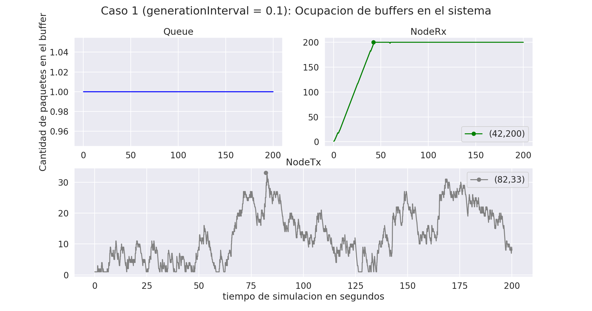
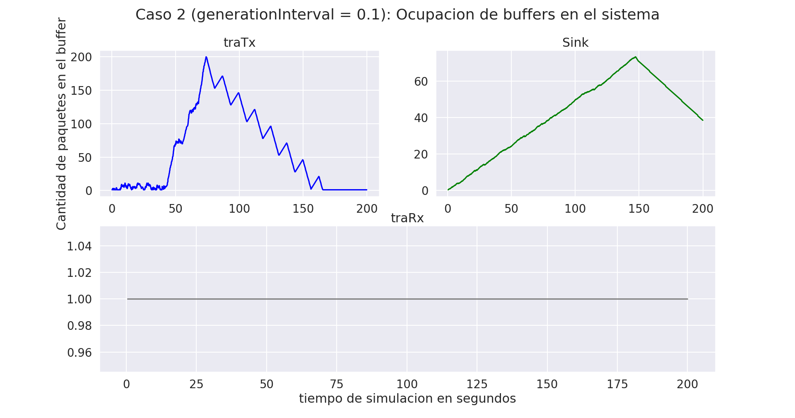

# Laboratorio 3: Capa de Transporte

## Primera parte

El objetivo de esta parte es análizar el tráfico de red de un modelo de colas, que posee bajas tasas de datos y un tamaño acotado en los *buffers*. El modelo consta de tres modulos simples: 

- Generador: Crea y transmite paquetes con intervalos dados por una distribución exponencial que nosotros podemos configurar.
- Queue: Atiende los paquetes, configurada con un valor máximo de 200.
- Sink: Se encarga de tomar métricas de la demora de entrega de los paquetes.

Ignora nociones de capacidad relacionadas con la transferencia de datos y memoria para *buffers*. La primera tarea que se nos presentó fue poder extender el *kickstarter* y así poder agregar estas funcionalidades.

Hicimos modificaciones en `network.ned` este es el archivo que se encarga de establecer todas las conexiones de nuestro modelo. añadimos los módulos NodeTx compuesto por un simple Generador y un simple Queue. Y NodeRx con un simple Queue y un simple Sink (Ahora el modelo tiene 3 colas). También fue necesario modificar el módulo gen para que tome como parámetro el tamaño del *buffer*.

Se realizaron modificaciones en los módulos implementados en `C++`, para que se pueda guardar el tamaño del paquete en bytes, medir el tiempo de servicio en la queue en base a la duración de transmisión del paquete una vez que se haya encolado y que se pueda controlar que el tamaño del *buffer* no sobrepase el límite configurado.

Por otra parte, se implementaron nuevas métricas (modulo Sink) para el análisis de Queue, para poder medir la cantidad de paquetes del buffer y que mida la cantidad de paquetes descartados por *buffer* saturado. Entonces el modelo completo es el siguiente:

Los supuestos más importantes de las simulaciones son que los paquetes siempre serán de 12500 B de tamaño, los *bufferes* son fijos (NodeRx = 200 B, NodeTx = 2000000 B y Queue = 200 B). Nosotros analizaremos los siguiente escenarios variando el intervalo de generación de paquetes (generationInterval) entre 0.1 y 1.

- Caso 1:
    - NodeTx a Queue: datarate = 1 Mbps y delay = 100 us
    - Queue a NodeRx: datarate = 1 Mbps y delay = 100 us
    - Queue a Sink: datarate = 0.5 Mbps
- Caso 2:
    - NodeTx a Queue: datarate = 1 Mbps y delay = 100 us
    - Queue a NodeRx: datarate = 0.5 Mbps y delay = 100 us
    - Queue a Sink: datarate = 1 Mbps

Nota: datarate = tasa de transferencia.

### Análisis en base a la teória

En base a la teoría podemos decir que para el caso 1 existirá un cuello de botella en NodeRx debido a que la tasa de transferencia de Queue a Sink es la mitad de lo que puede ser transferido generando una demora y hacer un uso más intensivo del *buffer* provocando una pérdida de paquetes.

Para el caso 2 tenemos que el cuello de botella estará en Queue ya que ocurre lo mismo que mencionamos en el párrafo anterior.

### Caso 1 con generationInterval de 0.1

En el siguiente gráfico, se presenta la ocupación de los *bufferes* en el sistema, se puede observar que tal como predice la teoría se produce un cuello de botella en NodeRx a los 42 segundos de la simulación. A su vez, los paquetes encolados en Queue se comportan de forma constante, siempre igual a 1.

Por otra parte, NodeTx presenta una tendencia muy variable, pero con un máximo muy marcado, en los 82 segundos y con 33 paquetes encolados simultáneamente.

Por último, podemos ver la cantidad de paquetes enviados (1979) y recibidos (1199) en tiempo de simulación, con un intervalo de generación de paquetes de 0.1 de los cuales se dropearon 780 paquetes, causados por la saturación de NodeRx.

### Caso 2 con generationInterval de 0.1

Para el caso 2, vemos que también se cumple la tesis inicial que pensábamos. En este caso, el cuello de botella se encuentra en Queue en un tiempo de simulación de 42 segundos. Ahora NodeRx se comporta de forma constante, encolando de a un paquete. Y NodeTx presenta una tendencia muy variada, con un máximo de paquetes encolados simultáneamente superior a 30 en 83 segundos de simulación.

En el siguiente gráfico vemos que presenta 980 paquetes dropeados, esto es porque se enviaron un total de 1979 y se recibieron 999 paquetes.

Cabe resaltar que el comportamiento de los casos 1 y 2 con un intervalo de generación de 0.1 son muy similares, solo que el cuello de botella se produce en distintos módulos y vemos que en el caso 2 la pérdida de paquetes es superior.

### Caso 1 con generationInterval de 1

El siguiente gráfico esboza el caso 1 con un intervalo de generación de paquetes centrado en 1, se puede ver que no hay cuellos de botellas en ninguno de los módulos. Y presentan un comportamiento constante, excepto por NodeTx que en un instante de tiempo de simulación (156) presenta un salto muy marcado donde se encolan 2 paquetes a la vez.

El análisis previo nos permite afirmar que la pérdida de paquetes debería ser relativamente nula, y se confirma con el gráfico donde se observa que los paquetes enviados y recibidos fueron de 200, por lo tanto no hubo pérdidas.

### Caso 2 con generationInterval de 1

En este caso pasa lo mismo que lo expuesto anteriormente, al ser la tasa de generación de paquetes más prolongada, los *bufferes* no se saturan y se mantienen constantes durante el periodo de simuláción y por ende no hay pérdida de paquetes como se puede ver en los gráficos.

### Preguntas a responder

¿Qué diferencia observa entre el caso de estudio 1 y 2? ¿Cuál es la fuente limitante en cada uno? Investigue sobre la diferencia entre control de flujo y control de congestión (ver Figura 6-22 del libro Tanenbaum).

Gracias a lo expuesto anteriormente podemos decir que la diferencia que se observa en cada caso es que presentan cuellos de botella distintos, tal como se predijo en el apartado de análisis en base a la teoría. Para el caso 1 la fuente limitante es la tasa de transferencia de datos en el tramo que va del nodeRx.queue al nodeRx.sink y para el caso 2 el que va de Network.queue al NodeRx.queue.
## Parte 2

La implementación de esta parte se encuentra en una *brach* llamada parte 2. Ahora el modelo esta dado por:

### Diseño
En está sección la tarea consiste en diseñar un sistema de control de flujo y congestión (entre el destino y el generador) de manera que se evite la pérdida de datos por saturación de *buffers*. Se agrega un canal de retorno desde nodeRx al nodeTx para que el receptor pueda acusar información que regule la tasa de transmisión (*feedback*). Así, las queues evolucionarán a un nuevo módulo denominado transportTx y transportRx.

Para poder realizar lo descrito anteriormente se generaron las clases TransportTx y TransportRx en base a la Queue ya existente. En nuestro modelo TransportRx es capaz de enviar información sobre el estado de su buffer a TransportTx para que regule el flujo de transferencia por medio de paquetes de *feedback*.

TransportTx cuenta con la posibilidad de que si hay congestión o el *buffer* receptor está lleno pueda retrasar el envío del mensaje para que no se pierda, también cuando está casi lleno puede bajar la generación de paquetes y en caso de que no supere el 90% de su capacidad, este puede pedir un aumento en la generación de paquetes.

Para poder probar esta parte corremos los mismos casos que en la sección anterior.
### Caso 1 con generationInterval de 0.1

En el gráfico se puede observar los módulos traTx (es el receptor intermedio en nodeTx y queue1), traRx (nodo intermedio entre queue1 y nodeRx) y Sink. Se puede ver claramente que nuestro algoritmo funciona de forma correcta, debido a que en los tres casos se llega a un punto de saturación del buffer pero luego cae rápidamente. Cabe resaltar que en traRx la caída no estan inmediata, cuando llega a 200 paquetes encolados simultáneamente se mantiene congestionado por 110 segundos aproximadamente, pero durante este tiempo tiene un efecto serrucho que es muy característico en TCP, donde la pérdida de paquetes no será constante (como en el caso 1 de la parte 1).

Los otros módulos que intervienen en el modelo presentan un comportamiento lineal, donde donde encolan un paquete por vez. Excepto en queue2 que inicialmente tiene en su *buffer* dos paquetes encolados, pero luego se comporta igual que los demás.

En el siguiente gráfico se presentan los paquetes enviados y recibidos en el sistema, se puede ver que se enviaron 1224 paquetes y se recibieron 996, por lo que podemos decir que se perdieron 228 paquetes debido a la congestión.

### Caso 1 con generationInterval de 1

En este caso donde cambiamos el intervalo de generación de paquetes se puede ver que traRx se comporta de forma constante, traTx en un solo momento de la simulación presenta más de un paquete encolado simultáneamente y por último sink oscila durante durante los 200 segundos, pero nunca satura el buffer.

Queue1 también se comporta de forma constante, pero queue2 varia mucho pero nunca presenta más de dos paquetes encolados simultáneamente.

Por lo presentado anteriormente y dado que aumentamos la generación de paquetes (tardan más en generarse), la pérdida de paquetes será muy poca o prácticamente nula, esto lo podemos ver en el siguiente gráfico que nos muestra que efectivamente se generaron 200 paquetes y no se perdió ninguno.

### Caso 2 con generationInterval de 0.1

Ahora vemos que traTx presenta un comportamiento oscilatorio pero nunca hay congestión debido a que se encolan a la vez como mucho 30 paquetes, el mismo comportamiento presenta sink pero un 40 paquetes encolados. Por otra parte traRx es constante con 1 paquete.

Para queue2 podemos decir que siempre se encuentran encolados 2 paquetes, pero el problema lo tenemos en queue1 aproximadamente luego de 45 segundos de simulación se congestiona con 200 paquetes encolados y nunca disminuye, esto causará una gran pérdida de paquetes.

En el gráfico se esboza que efectivamente hay una pérdida de paquetes, se generaron 1979 de los cuales solo se recibieron 996, esto quiere decir que 983 fueron dropeados. Cabe resaltar que se pierden menos paquetes que en el caso 2 de la parte 1 pero la diferencia es casi insignificante.

### Caso 2 con generationInterval de 1

Por último en esté caso, vemos un comportamiento muy similar al caso 1 con un intervalo de generación de 1, los módulos se comportan de la misma forma y no hay pérdida de paquetes.

### Preguntas a responder

¿Cómo cree que se comporta su algoritmo de control de flujo y congestión? ¿Funciona para el caso de estudio 1 y 2 por igual? ¿Por qué?

El algoritmo de control de flujo y congestión se comporta bien, debido a que reduce la pérdida de paquetes. Para el caso 1 con un intervalo de generación exponencial de 0.1 se comporta muy bien en relación al caso 1 inicial, debido a que se reduce de manera considerable la cantidad de paquetes dropeados, aunque existe un cuello de botella en traRx con un efecto serrucho.

A su vez, para el caso 2 con un intervalo de generación de 0.1 no notamos una gran diferencia, la cantidad de paquetes pérdidos se reduce pero no es considerable. El algoritmo no funciona muy bien debido a que produce un cuello de botella en el módulo queue1 el cual nunca se reduce.

## Referencias

[Evolución delos algoritmosde control de congestión en las distintas variantes del protocolo TCP](https://publicaciones.unpa.edu.ar/index.php/ICTUNPA/article/download/793/827/2730/)

[Control de congestión](https://www.tesisenred.net/bitstream/handle/10803/5966/08capitol5.pdf?sequence=8&isAllowed=y/)

[Tanenbaum](https://bibliotecavirtualapure.files.wordpress.com/2015/06/redes_de_computadoras-freelibros-org.pdf)
