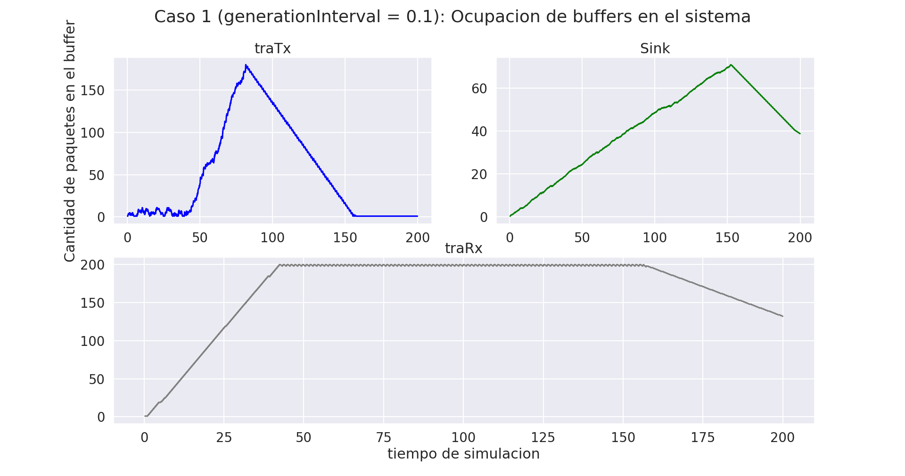
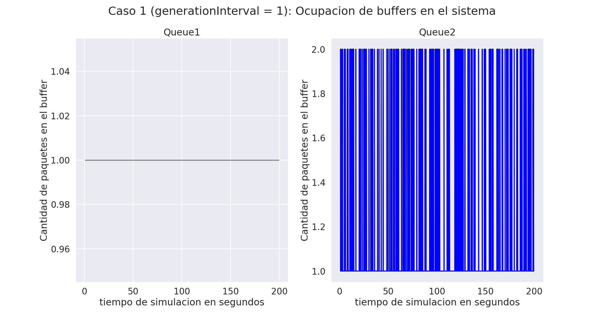

# Laboratorio 3: Capa de Transporte

El objetivo de este laboratorio consiste en leer, comprende y generar modelos en Omnet++. Analizar tráfico de red bajo tasas de datos acotadas y tamaño de buffers limitados. Y poder diseñar y proponer soluciones de control de congestión y flujo.
## Primera parte

En esta parte análizamos el tráfico de red de un modelo de colas, que posee bajas tasas de datos y un tamaño acotado en los *buffers*. El modelo consta de tres modulos simples: 

- Generador: Crea y transmite paquetes con intervalos dados por una distribución exponencial que nosotros podemos configurar.
- Queue: Atiende los paquetes, configurada con un valor máximo de 200.
- Sink: Se encarga de tomar métricas de la demora de entrega de los paquetes.

Ignora nociones de capacidad relacionadas con la transferencia de datos y memoria para *buffers*. La primera tarea que se nos presentó fue poder extender el *kickstarter* y así poder agregar estas funcionalidades.

Hicimos modificaciones en `network.ned` este es el archivo que se encarga de establecer todas las conexiones de nuestro modelo. Añadimos los módulos NodeTx compuesto por un simple Generador y un simple Queue. Y NodeRx con un simple Queue y un simple Sink, por lo que ahora el modelo tiene 3 colas. También fue necesario modificar el módulo gen para que tome como parámetro el tamaño del *buffer*.

También se realizaron cambios en los módulos implementados en `C++`, para que se pueda guardar el tamaño del paquete en bytes, medir el tiempo de servicio en la queue en base a la duración de transmisión del paquete una vez que se haya encolado y que se pueda controlar que el tamaño del *buffer* no sobrepase el límite configurado.

Por otra parte, se implementaron nuevas métricas (modulo Sink) para el análisis de Queue, para poder medir la cantidad de paquetes del buffer y la cantidad de paquetes descartados por *buffer* saturado. Entonces el modelo completo es el siguiente:

Los supuestos más importantes de las simulaciones son que los paquetes siempre serán de 12500 B de tamaño, los *bufferes* son fijos (NodeRx = 200 B, NodeTx = 2000000 B y Queue = 200 B). Nosotros analizaremos los siguiente escenarios variando el intervalo de generación de paquetes (generationInterval) entre 0.1 y 1.

- Caso 1:
    - NodeTx a Queue: datarate = 1 Mbps y delay = 100 us
    - Queue a NodeRx: datarate = 1 Mbps y delay = 100 us
    - Queue a Sink: datarate = 0.5 Mbps
- Caso 2:
    - NodeTx a Queue: datarate = 1 Mbps y delay = 100 us
    - Queue a NodeRx: datarate = 0.5 Mbps y delay = 100 us
    - Queue a Sink: datarate = 1 Mbps

Nota: datarate = tasa de transferencia.

### Análisis en base a la teória

En base a la teoría podemos decir que para el caso 1 existirá un cuello de botella en NodeRx debido a que la tasa de transferencia de Queue a Sink es la mitad de lo que puede ser transferido generando una demora y provocando un uso más intensivo del *buffer* y por ende una pérdida de paquetes.

Para el caso 2 tenemos que el cuello de botella estará en Queue ya que ocurre lo mismo que mencionamos en el párrafo anterior.

### Caso 1 con generationInterval de 0.1

En el siguiente gráfico, se presenta la ocupación de los *bufferes* en el sistema, se puede observar que tal como predice la teoría se produce un cuello de botella constantee en NodeRx a los 42 segundos de la simulación lo que llevará a una pérdida de paquetes. A su vez, los paquetes encolados en Queue se comportan de forma constante, siempre igual a 1.

Por otra parte, NodeTx presenta una tendencia muy variable, pero con un máximo muy marcado, en los 82 segundos y con 33 paquetes encolados simultáneamente.

Por último, podemos ver la cantidad de paquetes enviados (1979) y recibidos (1199) en tiempo de simulación, con un intervalo de generación de paquetes de 0.1 de los cuales se dropearon 780 paquetes, causados por la saturación de NodeRx.

### Caso 2 con generationInterval de 0.1

Para el caso 2, vemos que también se cumple la hipótesis inicial que planteamos. En este caso, el cuello de botella se encuentra en Queue en un tiempo de simulación de 42 segundos. Ahora NodeRx se comporta de forma constante, encolando de a 1 paquete. Y NodeTx presenta una tendencia muy variada, con un máximo de paquetes encolados simultáneamente superior a 30 en 83 segundos de simulación.

En el siguiente gráfico vemos que presenta 980 paquetes dropeados, esto es porque se enviaron un total de 1979 y se recibieron 999 paquetes.

Cabe resaltar que el comportamiento de los casos 1 y 2 con un intervalo de generación de 0.1 son muy similares, solo que el cuello de botella se produce en distintos módulos y vemos que en el caso 2 la pérdida de paquetes es superior.

### Caso 1 con generationInterval de 1

El siguiente gráfico esboza el caso 1 con un intervalo de generación de paquetes centrado en 1, se puede ver que no hay cuellos de botellas en ninguno de los módulos. Y presentan un comportamiento constante, excepto por NodeTx que en un instante de tiempo de simulación (156) presenta un salto muy marcado donde se encolan 2 paquetes a la vez.

El análisis previo nos permite afirmar que la pérdida de paquetes debería ser relativamente nula, y se confirma con el gráfico donde se observa que los paquetes enviados y recibidos fueron de 200, por lo tanto no hubo pérdidas.

### Caso 2 con generationInterval de 1

En este caso pasa lo mismo que lo expuesto anteriormente, al ser la tasa de generación de paquetes más prolongada, los *bufferes* no se saturan y se mantienen constantes durante el periodo de simuláción y por ende no hay pérdida de paquetes como se puede ver en los gráficos.

### Preguntas a responder

¿Qué diferencia observa entre el caso de estudio 1 y 2? ¿Cuál es la fuente limitante en cada uno? Investigue sobre la diferencia entre control de flujo y control de congestión (ver Figura 6-22 del libro Tanenbaum).

Gracias a lo expuesto anteriormente podemos decir que la diferencia que se observa en cada caso es que presentan cuellos de botella distintos, tal como se predijo en el apartado de análisis en base a la teoría. Para el caso 1 la fuente limitante es la tasa de transferencia de datos en el tramo que va del nodeRx.queue al nodeRx.sink y para el caso 2 el que va de Network.queue al NodeRx.queue.
## Parte 2

La implementación de esta parte se encuentra en una *brach* llamada parte 2. Ahora el modelo esta dado por:

### Diseño

En está sección la tarea consiste en diseñar un sistema de control de flujo y congestión (entre el destino y el generador) de manera que se evite la pérdida de datos por saturación de *buffers*. Se agrega un canal de retorno desde nodeRx al nodeTx para que el receptor pueda enviar información que regule la tasa de transmisión (paquetes de *feedback*). Así, las queues evolucionarán a un nuevo módulo denominado transportTx y transportRx.

Para poder realizar lo descrito anteriormente se generaron las clases TransportTx y TransportRx en base a la Queue ya existente. En nuestro modelo TransportRx es capaz de enviar información sobre el estado de su buffer a TransportTx para que regule el flujo de transferencia por medio de paquetes de *feedback*.

TransportTx cuenta con la posibilidad de que si hay congestión o el *buffer* receptor está lleno pueda retrasar el envío del mensaje para que no se pierda, también cuando está casi lleno puede bajar la generación de paquetes y en caso de que no supere el 85% de su capacidad, este puede pedir un aumento en la generación de paquetes.

Por último se realizaron modificaciones en Queue debido a que aquí es donde se generaba el cuello de botella para el caso 2, con lo anterior solo solucionabamos los problemas del caso 1.

Entonces, el módulo ahora tiene la capacidad de que si existe congestión lo notifica por medio de un paquete de *feedback* y cuando el *buffer* se libere en un 15%, es decir, ya no exista congestión también lo notifica.

Con esto solucionamos los problemas de los cuellos de botella generados por la congestión y a su vez al variar la tasa de generación de paquetes controlamos el flujo que pasa por el canal y de esta forma poder minimizar la pérdida de paquetes.

Al solucionar estos problemas, los *bufferes* que se congestionaban tendrían que tener el comportamiento que se muesta en el siguiente gráfico muy característico en TCP. Donde la pérdida de paquetes se produce cuando se llega al punto de saturación, luego hay una fase descendente, seguida de una ascendente de congestión y como consecuencia pérdida de paquetes. Lo importante es que la pérdida no es constante como nos pasaba en la parte 1, ahora es mucho menor.

Para poder probar esta parte corremos los mismos casos que en la sección anterior.
### Caso 1 con generationInterval de 0.1

En el gráfico se puede observar los módulos traTx (es el receptor intermedio en nodeTx y queue1), traRx (nodo intermedio entre queue1 y nodeRx) y Sink. Se puede ver claramente que nuestro algoritmo funciona de forma correcta, debido a que en los tres casos se llega a un punto de saturación del buffer pero luego cae rápidamente. Cabe resaltar que en traRx la caída no estan inmediata, cuando llega a 200 paquetes encolados simultáneamente se mantiene congestionado por 110 segundos aproximadamente, pero durante este tiempo tiene un efecto serrucho que es muy característico en TCP, como expusimos anteriormente.

Los otros módulos que intervienen en el modelo presentan un comportamiento lineal, encolan un paquete por vez. Excepto en queue2 que inicialmente tiene en su *buffer* dos paquetes encolados, pero luego se comporta igual que los demás.

En el siguiente gráfico se presentan los paquetes enviados y recibidos en el sistema, se puede ver que se enviaron 1081 paquetes y se recibieron 998, por lo que podemos decir que se perdieron 83 paquetes debido a la congestión.

### Caso 1 con generationInterval de 1

En este caso donde cambiamos el intervalo de generación de paquetes se observa que traRx se comporta de forma constante, traTx en un solo momento de la simulación presenta más de un paquete encolado simultáneamente y por último sink oscila durante durante los 200 segundos, pero nunca satura el buffer.

Queue1 también se comporta de forma constante, pero queue2 varia mucho pero nunca presenta más de dos paquetes encolados simultáneamente.

Por lo presentado anteriormente y dado que aumentamos la generación de paquetes (tardan más en generarse), la pérdida de paquetes será muy poca o prácticamente nula, esto lo podemos ver en el siguiente gráfico que nos muestra que efectivamente se generaron 200 paquetes y no se perdió ninguno.

### Caso 2 con generationInterval de 0.1

Ahora vemos que traTx presenta un máximo muy marcado en el cual se satura el buffes, en el caso de sink el comportamiento es similar con un máximo que destaca seguido de una caída, cabe destacar que se encolan simultáneamente más de 60 paquetes por lo que nunca se satura. Por otra parte traRx es constante con 1 paquete.

Para queue2 podemos decir que siempre se encuentran 2 paquetes, pero el problema lo tenemos en queue1 aproximadamente luego de 45 segundos de simulación se congestiona y produce una pérdida de paquetes. Está perdida no es constante debido al efecto serrucho que presenta la curva.

En el gráfico se esboza que efectivamente hay una pérdida de paquetes, se generaron 1127 de los cuales solo se recibieron 997, esto quiere decir que 144 fueron dropeados. Cabe resaltar que se pierden menos paquetes que en el caso 2 de la parte 1.

### Caso 2 con generationInterval de 1

Por último en esté caso, vemos un comportamiento muy similar al caso 1 con un intervalo de generación de 1, los módulos se comportan de la misma forma y no hay pérdida de paquetes.

### Preguntas a responder

¿Cómo cree que se comporta su algoritmo de control de flujo y congestión? ¿Funciona para el caso de estudio 1 y 2 por igual? ¿Por qué?

El algoritmo de control de flujo y congestión se comporta bien, debido a que reduce la pérdida de paquetes. Para el caso 1 con un intervalo de generación exponencial de 0.1 se comporta muy bien en relación al caso 1 inicial, debido a que se reduce de manera considerable la cantidad de paquetes dropeados, aunque existe un cuello de botella en traRx con un efecto serrucho.

A su vez, para el caso 2 con un intervalo de generación de 0.1 también funciona correctamente. Esto de debe a que se regulo la tasa de transferencia y se notifica en caso de congestión en los modulos Queue y TransporTx, que eran justamente en los casos donde existian los cuellos de botella en la parte 1.

## Carga útil vs carga ofrecida

A modo de comparación en las siguientes figuras se presenta la carga útil y ofrecida para todos los casos y las respectivas partes que fueron desarrolladas en el transcurso del trabajo.

Los puntos de esta curva se corresponden con diferentes tasas de transmisión de paquetes, de esta forma podemos ver como para diferentes configuraciones de carga ofrecida, cuál es la carga útil total que llega a destino. En otras palabras, vemos la cantidad de paquetes por segundo que se inyectan por el transmisor (nodeTx) y el total de paquetes por segundo que llegan al destino final.

### Caso 1: parte 1 vs parte 2

Si todo funcionará bien el comportamiento de esta curva tendría que ser lineal (una recta de 45 grados que sale del origen), es decir, se mantendría la proporción entre paquetes transmitidos y recibidos en el destino final por segundo.

Gracias a lo mencionado en el párrafo anterior, en fácil identificar en el gráfico la tasa de tráfico a la cual el transmisor empieza a perder paquetes. Se puede ver un quiebre muy marcado cuando la carga ofrecida es mayor que 5 paquetes por segundo, la correspondencia línea con la carga útil ya no se verifica y por ende la curva se aplana. Esto sucede para las dos curvas presentadas, pero en la curva azul que se corresponde con el caso 1 de la parte 1 el *overhead* es mucho mayor.

En el caso 1 parte 2, donde está implementado nuestro algoritmo el efecto en la pérdida de paquetes no es tan grande debido a que la curva no se aplana tanto, pero si tiene una leve caída o colapso por la congestión esto se debe a que el mecanismo de *feedbback* que usamos termina siendo mucho más caro cuando hay una alta tasa de transmisión y por ende se relentiza el sistema (los paquetes se pueden retrasar el tiempo suficiente dentro de la red como para que ya no sean útilies cuando salgan de ella).

### Caso 2: parte 1 vs parte 2

En este caso se presenta un comportamiento similar al anterior, donde las curvas se comportan con una relación lineal hasta una tasa de 5 paquetes por segundo aproximadamente. Luego de esto ambas se aplanan produciendo una pérdida de paquetes.

En el caso 2, parte 1 (línea azul) la pérdida de la relación lineal es mucho mayor que para el caso 2, parte 2 (línea verde) lo importante a resaltar en este caso es que la curva no presenta una leve caída como en el caso anterior sino que aumenta levemente, esto es muy bueno y nos dice que nuestro algoritmo funciona de la forma que esperábamos.

## Posibles extensiones

Podemos decir que los resultados del trabajo cumplen con lo previsto, pues nuestro algoritmo logra una reducción en la pérdida de paquetes. Nos hubiera gustado implementar un algoritmo específico de control de congestión visto en el teórico como lo son Reno o Taloe y poder analizar su comportamiento en la práctica.
## Referencias

[Evolución de los algoritmos de control de congestión en las distintas variantes del protocolo TCP](https://publicaciones.unpa.edu.ar/index.php/ICTUNPA/article/download/793/827/2730/)

[Control de congestión](https://www.tesisenred.net/bitstream/handle/10803/5966/08capitol5.pdf?sequence=8&isAllowed=y/)

[Tanenbaum](https://bibliotecavirtualapure.files.wordpress.com/2015/06/redes_de_computadoras-freelibros-org.pdf)

[Colab para gráficos](https://colab.research.google.com/drive/1_uT3BfnePUV1L-NAM0qmzWjLNb4xTUsB?usp=sharing)